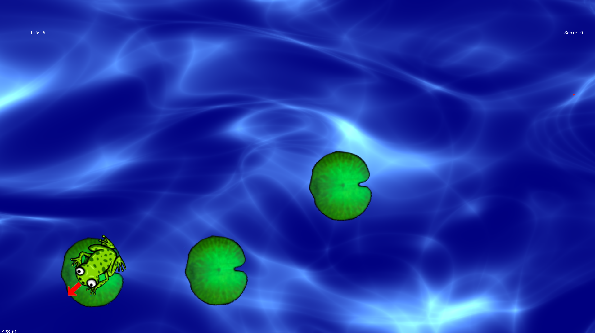

# Froppy, a game with a cute little frog

### How to launch the game : 
Go to the [`ScreenSelector`](src/window/ScreenSelector)

Our game is mainly in `src/window`, but our classes are in `src/ch/hevs/gdx2d` directory. All our images, fonts or shaders are in data

You can change the skin of the game in the Settings if you want a funny reference to our school!

Here is a small preview of our game : 
